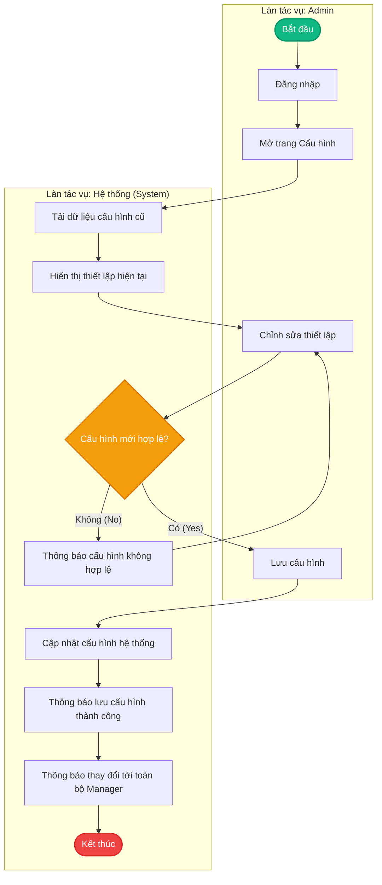

# Quy trình Swimlane - Admin

Tài liệu này tổng hợp các quy trình nghiệp vụ dạng Swimlane của vai trò **Admin** trong hệ thống.

---

## 1. Quy trình: Admin Configure System (Cấu hình hệ thống)

Quy trình này mô tả các bước Admin thực hiện thiết lập cấu hình hệ thống, từ bước đăng nhập, thay đổi cấu hình, kiểm tra tính hợp lệ bởi hệ thống, lưu trữ và thông báo cho các bên liên quan.



---

## 2. Quy trình: Admin View Reports (Xem báo cáo)

Quy trình này mô tả các bước Admin xem các báo cáo và số liệu thống kê trên bảng điều khiển (Dashboard) và tải báo cáo về thiết bị.

```mermaid
flowchart TD
    %% Định nghĩa các Swimlane bằng Subgraph
    subgraph Admin ["Làn tác vụ: Admin"]
        A2_Start([Bắt đầu])
        A2_Login[Đăng nhập]
        A2_OpenDB[Mở Bảng điều khiển (Dashboard)]
        A2_ViewDB[Xem Bảng điều khiển]
        A2_DownloadRep[Tải báo cáo về]
    end

    subgraph System ["Làn tác vụ: Hệ thống (System)"]
        S2_RetrieveData[Truy xuất dữ liệu báo cáo]
        S2_GenerateRep[Tạo báo cáo và số liệu thống kê]
        S2_DisplayRep[Hiển thị báo cáo & số liệu]
        S2_End([Kết thúc])
    end

    %% Luồng nghiệp vụ liên kết giữa các làn
    A2_Start --> A2_Login
    A2_Login --> A2_OpenDB
    A2_OpenDB --> S2_RetrieveData
    S2_RetrieveData --> S2_GenerateRep
    S2_GenerateRep --> S2_DisplayRep
    S2_DisplayRep --> A2_ViewDB
    A2_ViewDB --> A2_DownloadRep
    A2_DownloadRep --> S2_End

    %% Định nghĩa Style
    style A2_Start fill:#10b981,stroke:#059669,stroke-width:2px,color:#fff
    style S2_End fill:#ef4444,stroke:#dc2626,stroke-width:2px,color:#fff
```
