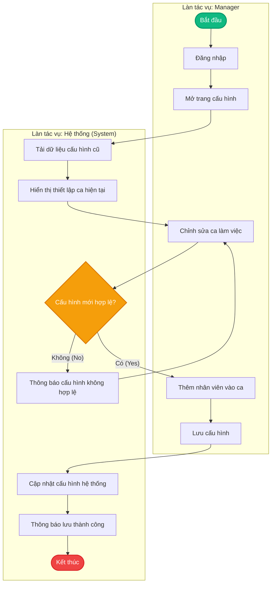
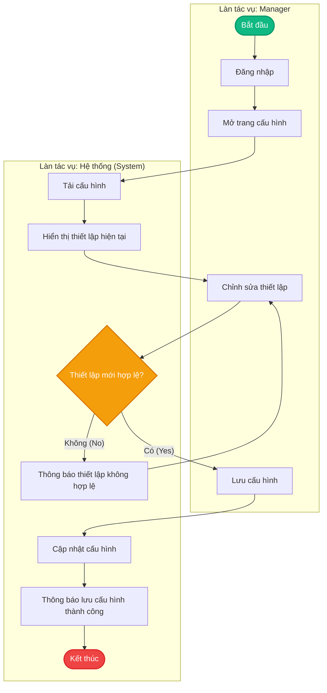
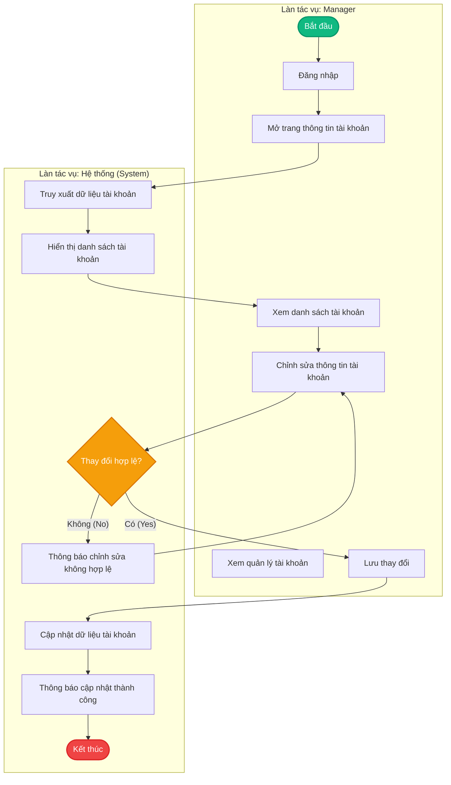
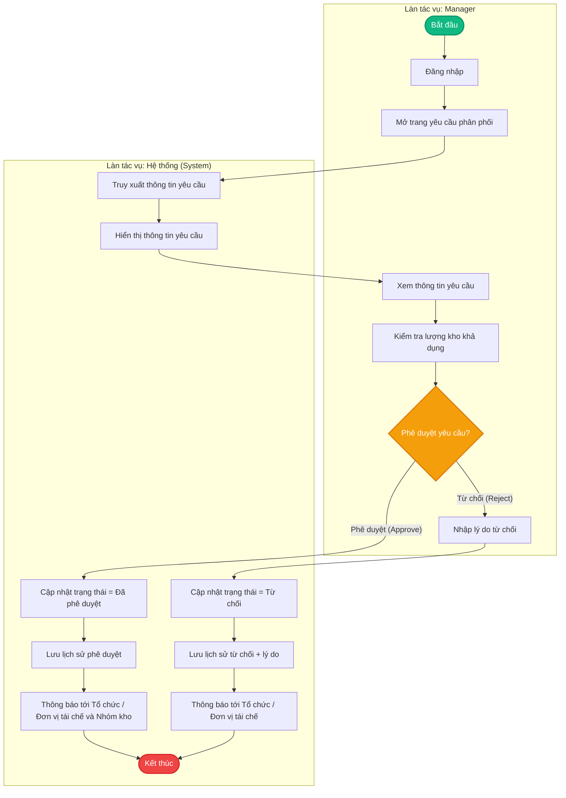
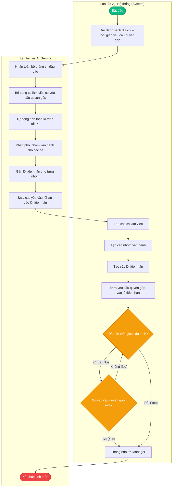
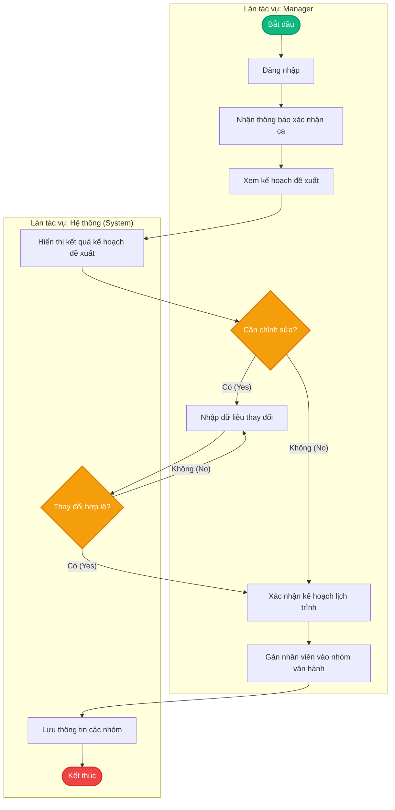
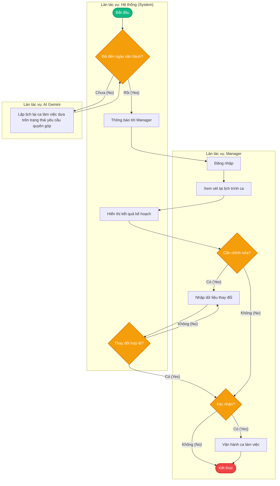
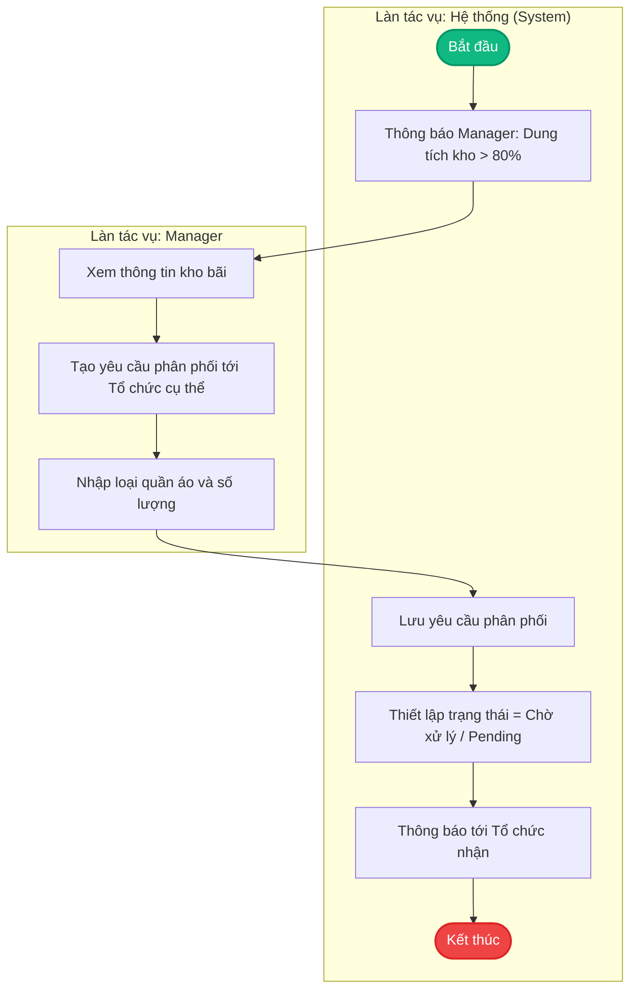
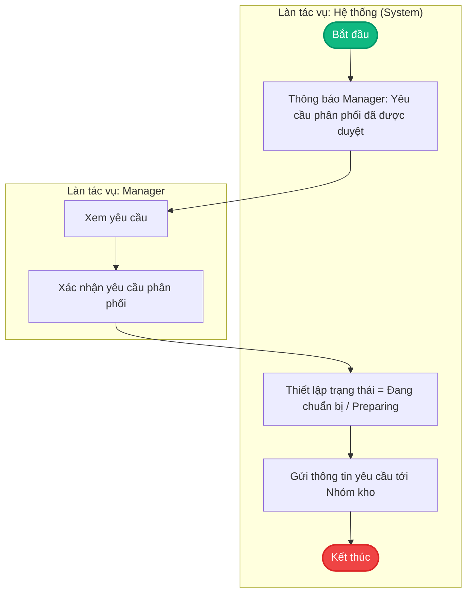

# Quy quy trình Swimlane - Manager

Tài liệu này tổng hợp toàn bộ các quy trình nghiệp vụ dạng Swimlane của vai trò **Manager** và sự tương tác giữa **Manager**, **Hệ thống (System)** và **AI Gemini**.

---

## 1. Nhóm cấu hình (Configuration)

### 1.1. Manager Configure Shift (Cấu hình ca làm việc)
Quy trình giúp Manager thiết lập, chỉnh sửa ca làm việc và phân bổ nhân sự vào ca.



### 1.2. Manager Configure System (Cấu hình hệ thống)
Quy trình Manager thiết lập các cấu hình hệ thống tổng quát.



---

## 2. Nhóm quản lý tài khoản & Yêu cầu (Account & Requests)

### 2.1. Manager Manage Account (Quản lý tài khoản)
Quy trình Manager quản lý các tài khoản trong hệ thống.



### 2.2. Manager Approve Organization's Request (Phê duyệt yêu cầu từ Tổ chức)
Quy trình tiếp nhận và phê duyệt/từ chối các yêu cầu phân phối quần áo từ các tổ chức/đơn vị.



---

## 3. Nhóm xem báo cáo (Reports)

### 3.1. Manager View Reports (Xem báo cáo & Thống kê)
Quy trình Manager truy xuất, kiểm tra số liệu và tải báo cáo về thiết bị.

```mermaid
flowchart TD
    subgraph Manager ["Làn tác vụ: Manager"]
        M5_Start([Bắt đầu])
        M5_Login[Đăng nhập]
        M5_OpenDB[Mở Bảng điều khiển (Dashboard)]
        M5_ViewDB[Xem Bảng điều khiển]
        M5_Download[Tải báo cáo về]
    end

    subgraph System ["Làn tác vụ: Hệ thống (System)"]
        S5_Retrieve[Truy xuất dữ liệu báo cáo]
        S5_Generate[Tạo báo cáo và số liệu thống kê]
        S5_Display[Hiển thị báo cáo & số liệu]
        S5_End([Kết thúc])
    end

    M5_Start --> M5_Login
    M5_Login --> M5_OpenDB
    M5_OpenDB --> S5_Retrieve
    S5_Retrieve --> S5_Generate
    S5_Generate --> S5_Display
    S5_Display --> M5_ViewDB
    M5_ViewDB --> M5_Download
    M5_Download --> S5_End

    style M5_Start fill:#10b981,stroke:#059669,stroke-width:2px,color:#fff
    style S5_End fill:#ef4444,stroke:#dc2626,stroke-width:2px,color:#fff
```

---

## 4. Nhóm lập lịch trình bằng AI (Gemini Planning & Shifts)

### 4.1. Gemini Planning Shifts (Gemini lập lịch thu gom tự động)
Quy trình tự động hóa lập kế hoạch gom hàng chạy ngầm bằng AI Gemini dựa trên thời gian và thông tin các điểm gom.



### 4.2. Manager Confirm Planning Shift (Xác nhận lịch trình đề xuất)
Quy trình Manager kiểm tra, điều chỉnh và xác nhận lịch trình ca làm việc được tạo bởi AI.



### 4.3. Manager re-confirm shift planning (Tái cấu trúc và xác nhận lại)
Quy trình xử lý việc cập nhật lại lịch trình khi có sự thay đổi vào ngày vận hành thực tế.



---

## 5. Nhóm phân phối hàng hóa (Distribution Requests)

### 5.1. Tạo yêu cầu phân phối khi kho đầy (>80%)
Quy trình tự động kích hoạt khi dung tích lưu trữ của kho vượt quá 80%, Manager tạo yêu cầu phân phối đến các tổ chức thích hợp.



### 5.2. Xác nhận yêu cầu phân phối đã được duyệt
Quy trình Manager xác nhận yêu cầu phân phối đã được phê duyệt thành công để tiến hành chuẩn bị đóng gói và chuyển giao cho nhóm kho.


